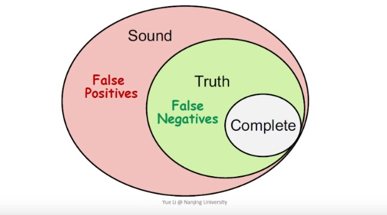

# Software Analysis lecture1 笔记

从这一篇开始我将会整理我的Software Analysis（Static Analysis）课程笔记放在博客上，这份笔记不会是课程完整内容的记录，而是会融入自己的一些理解和课程内容的补充，有什么理解不到位的或者错误的地方，可以联系我的Email指正，顺便一提，我最近开了这门课的课程群，欢迎对SA有兴趣或者在跟这门课的同学加入我们。

Programming Language这个领域关心的问题大致可以分成三个部分：

1. theory：这个部分关注的问题，例如type system，programming paradigm等。具体的就是诸如generic type/template type的设计，maybe/optional类型改善null，differential programing之类工作属于这一块

2. environment：这个部分关注一些实现上的问题。例如编译器，runtime等，JVM就可以归为这个领域的工作

3. application：这个部分关注在运行前能对程序代码进行的一些工作，例如错误检测，代码优化等等，IDE里面就大量应用了SA的成果，如变量未定义的错误提示，循环中的不变量表达式的移出优化；程序的静态验证（或者叫程序证明），程序合成等等

主要用的技术有抽象解释（Abstract interpretation），数据流分析（Data-flow analysis），Hoare logic，Model checking，Symbolic execution等等，本课程只会讲到其中的两个，分别是数据流分析和抽象解释，重点讲的是数据流分析。

那么什么样的SA是完美的呢？定义是既overapproximate又underapproximate的SA是完美的。overapproximate也叫sound，underapproximate也叫complete，他们之间的关系可以用一个图很好的表示


complete表示报告包含的错误都是真实的错误，但可能并未包含全部的错误，造成了漏报，
$$! actualReported \subseteq true $$
sound表示报告包含了所有的真实错误，但可能包含了误报的错误，导致误报，
$$! true \subseteq actualReported $$
completeness: true - complete = false negative ->漏报
soundness: sound - true = false positive -> 误报
用个代码分析例子来说明什么是overapproximate和underapproximate：
```
if (input) {
    x = 1
} else {
    x = 0
}
```
对于这样的一段代码，静态分析的结果报告如果$$x \in \\{0, 1\\}$$，就说这个静态分析是完美的，如果报告$$x \in \\{0\\}$$，就说这个分析是complete的（也说对程序进行了underapproximate），如果报告$$x \in \\{0, 1, 2, 3\\}$$就说这个分析是sound（也说对程序进行了overapproximate），如果报告是$$x \in \\{-1, 0\\}$$，就是既发生了漏报（漏报1），也发生了误报（误报-1）,则这个分析是错误的。

说完complete和sound，来继续说说分析成本，同样是sound的报告，不同的分析精度可以给出不同精度的sound报告，例如上面的例子可以给出两种精度不同的报告：

1. $$x \in \\{0, 1\\}$$
2. x = 1 when input == true, x = 0 when input == false

可以看出第二种的精度更高一些，因为报告中包含了x具体情况下的取值，但是这种方式也要求分析过程维护上下文信息，从而提高了分析的代价，而静态分析的目标应该是在确保（或尽量接近）sound的前提下在精度和速度上做一个平衡，试想一下IDE在你写下使用一个未初始化变量的代码后二十秒后才给出提示，做静态分析要把握住精度的控制，不然极端情况下岂不是要把静态分析往解释器的方向写了吗？

完美的SA等价于false positive =$$ \emptyset $$ 且 false negative = $$ \emptyset $$，既sound又complete。而课上讲过一个大米定理（Rice Theorem），意思是说这个世界上没有完美的SA，这个定理和deep learning领域的universal approximation theorem一般，让人觉得很没意思。

既然完美的SA是不存在的了，那么只能妥协soundness保全completeness。或者妥协completeness来保全soundness，可以根据具体应用去选择妥协哪一个，例如编译器和程序验证一般选择sound，而bug finding一般做成complete，实际上绝大多数静态分析应用都是妥协completeness，尽量做到sound，为什么呢？妥协soundness会造成漏报，妥协completeness会造成误报，岂不是静态分析应用大多选择了误报？究其原因，对于很多的系统来说运行时发生bug的成本相对运行前人力检验bug的真伪高，尤其是军工，航天领域，所以对于这样的一类系统，优先选择sound。

static analysis的过程分为两个步骤：

abstraction

这一步就是把分析所关注的数据抽象到某种容易操作的域上，例如课程上讲的除0分析的一个例子，这里稍做修改，例如对于下面这段C程序：
```
#include<stdio.h>
    void main() {
        int arr[3] = {0, 1, 2};
        int x = 10;
        int y = -1;
        int z = 0;
        int a = x + y;
        int b = z / y;
        int c = a / b;
        int p = arr[y];
        int q = arr[a];
        printf("the number is %d", q);
    }
```
因为只关心算术表达式，所以将算术表达式提取出来，对表达式进行抽象，建立一个从“算术表达式”到“符号”的抽象：
```
abstract value:
        表达式          符号
map:    v=100       ->  +
map:    v=1         ->  +
map:    v=-1        ->  -
map:    v=0         ->  0
map:    v=e?1:-1    ->  unknown
map:    v=w/0       ->  undefined
```
unknown表示可能为+可能为-可能为0，这里也可以说是任意合法的整数，undefined表示除0，也就是发生了错误。

**overapproximation**

有了数据抽象之后，还需要定义一个transfer function，transfer function是作用在程序代码的抽象值上的，对应这个例子就是从“算术表达式抽象符号”到“符号”上的函数，有以下定义：
```
transfer function:
map:    + + + = +
map:    - + - = -
map:    0 + 0 = 0
map:    + + - = unknown
map:    + / + = +
map:    - / - = +
map:    unknown / 0 = undefined
map:    + / - = -
```
然后用上面的抽象值和transfer function在代码上做overapproximate分析，得到下面的结果
```
#include<stdio.h>
    void main() {
        int arr[3] = {0, 1, 2};
        int x = 10;     // +
        int y = -1;     // -
        int z = 0;      // 0
        int a = x + y;  // unknown
        int b = z / y;  // 0
        int c = a / b;  // undefined 除0错误
        int p = arr[y];
        int q = arr[a];
        printf("the number is %d", q);
    }
```
从上面的例子可以看出静态分析的威力。

references:

[[1] https://www.bilibili.com/video/BV1b7411K7P4](https://www.bilibili.com/video/BV1b7411K7P4)

[[2] https://courses.cs.washington.edu/courses/cse403/16au/lectures/L15.pdf](https://courses.cs.washington.edu/courses/cse403/16au/lectures/L15.pdf)

[[3] https://en.wikipedia.org/wiki/Static_program_analysis](https://en.wikipedia.org/wiki/Static_program_analysis)


