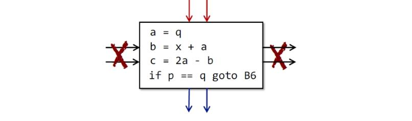

# Software Analysis lecture2 笔记-Intermediate Representation

学过编译原理都知道，从源代码到目标机器码大致上要经历

    词法分析->语法分析->语义分析->中间代码生成->目标代码生成


一般统称中间代码（IR）之前的编译器部分为前端（front-end），中间代码之后的部分叫后端（back-end），SA一般在中间代码上进行，也有一些SA会在抽象语法树上做，但抽象语法树上不适合做规模过大的分析，这里解释一下为什么一般不在抽象语法树上做，而在中间代码上做:

1. 中间表达往往是语言无关的，不同的上层语言例如Java和JS，都可以转换成同一种中间代码，所以静态分析只需要对这种中间代码实现就可以分析很多不同的前端语言，LLVM和HW的方舟编译器就是例子

2. 中简代码的流程很直观的反映了控制流（control flow）信息

感受一下抽象语法树和中间代码的直观对比


所以做SA必须提供一个编译器前端来将源代码转成中间代码，那为何不直接在源代码上做SA呢？原因是SA一般不是用来分析trivial错误的工具，而是分析non-trivial错误的，什么是trivial的错误？例如拼写错误，语法错误等一些可以被编译器前端处理的错误，non-trivial就是一些与运行时相关的错误，例如对于

```
y= scanf("%d"， &a);
y = x? x: x/y
```

y在运行时可能为0导致除0错误，这个错误就是non-trivial的。

中间代码有很多种，例如C#的CIR和Java的bytecode，这门课用到的是三地址码(3-address code)，三地址码的特点就是一个表达式（指令）只包含一个运算，例如对于`a + b + 3`这样的上层语言的表达式最后会被转成

```
t1 = a + b
t2 = t1 + 3
```

至于为什么会叫三地址码这样奇怪的名字，因为在三地址码的代码中，每个表达式只会包含三种实体，一个是带名字的变量（例如代码中a，b），一种是常量（例如代码中的3），一种translator生成的临时变量（例如代码中的t1，t2）

这里给出Java的一个静态分析框架soot使用的一种叫Jimple的三地址码例子


另一个八十年代提出的非常经典的中间代码格式——Static Single Assignment，特点是为**每一次赋值行为赋予一个新的变量名，且在这个程序的整个生命周期内的任一变量仅有唯一的定义**，例如对于源代码为

```
x = x + y + 3
x = x * x
z = x + 10
```

其生成的三地址码和SSA分别如下

```
3-address-code(3AC)                 static-single-assignment(SSA)
t1 = x + y                          t1 = x + y
x = t1 + 3                          x = t1 + 3
x = x * x   -----fresh name-----    x1 = x * x
z = x + 10                          z = x1 + 10
```

注意到x被两次赋值，在SSA中会为第二次赋值分配一个新的变量名字，对于有分支的情况，例如源代码为

```
if(e)
    x = 0
else
    x = 1
y = x - 7
```

需要在分支汇合的结点处引入$$ phi $$函数来避免x可能出现多个定义（例如图中x=0或者x=1导致多个定义）的情况，其生成的SSA代码是

```
    if (e) goto L1 
    x1 = 1
    goto L2
L1  x2 = 0
L2  x_t = phi(x1, x2)
    y = x_t -7
```

SSA在某些场景下能简化分析，因为不用维护上下文信息，利于分析并行化？可以用来进行flow insensitive分析，尽管flow insensitive分析有较快的速度但是会导致精度下降，而SSA在有些场景下仍可以保持flow sensitive的精度；缺点也很明显，就是引入过多的变量名和$$ phi $$函数。

SA的基础结构是控制流(control flow)，而控制流由多个基本块(basic block)组成，那么基本块是什么？基本块的定义是**仅可从入口处进入，出口处退出的最大连续指令序列**，也就是说一个基本块只能从它的第一条语句进入（可以是多个进入箭头），退出的箭头也仅可从这个块的最后一条语句出发。例如下图



给一段三地址码的序列，尝试给它分成多个基本块，过程如下：**一个基本块由它的块头（leader）加上所有直到下一个块头的指令序列组成**。所以问题顺理成章转化成了如何找到一个块头和它的下一个块头，找块头的算法如下：

1. 程序的第一条指令是一个块头
2. 作为跳转指令的目标位置的指令是一个块头
3. 紧跟跳转指令的下一条指令是一个块头


根据1，可知1是块头

根据2，可知7，12，3是块头

根据3，可知5，11，12是块头

那么可以得出所有基本块

```
    B1{1, 2}
    B2{3, 4}
    B3{5, 6}
    B4{7, 8, 9, 10}
    B5{11}
    B6{12}
```

得到了基本块后，将前一幅图中的跳转语句中的指令位置换成所属的基本块编号，然后为这些块之间添加有向连接，得到了控制流图（control flow graph）


下一节讲的数据流分析（data flow analysis）就是在控制流图上进行。