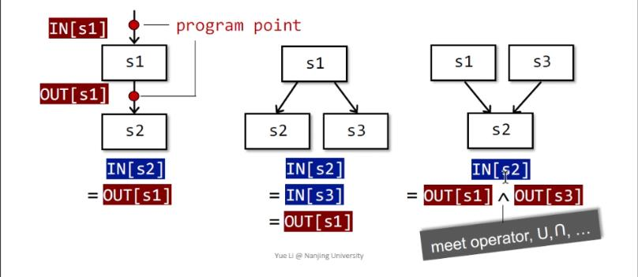

# Software Analysis lecture3 笔记-Data Flow Analysis I

这一节和下一节讲数据流分析的应用部分。静态分析技术里面的应用有很多，但这门课会详细讲到的只有三种，分别为：

+ Reaching Definitons Analysis
+ Live Variables Analysis
+ Available Expression Analysis

选用这三种的原因是这三种在静态分析技术里面非常有代表性，其中RDA和LVA为may analysis，AEA为must analysis；而RDA和AEA又是forward analysis，而LVA是backward analysis；首先解释下may analysis的意思，其实就是上节课讲到的对程序进行over-approximate，而must analysis即是对程序进行under-approximate，或者可以这样理解，may analysis输出的报告是一种特称命题（存在分支使得X发生），而must analysis是一种全称命题（对于所有分支，X必然发生）；让我们来看例子

```
Integer x = 1;
Integer y;
assert input < 100 && input > -100
if(input < 10) {
    x = 11 
} else {
    x = 29
    y = 100
}
return (input.equals(x) ? 1 : 2) + y
```

对以上代码做未初始化变量检测分析的时候，输出报告为*y可能未初始化*，这就是一种may analysis

说明must analysis有个很好的例子，jvm会将较小-128~127的整数缓存在常量区以便高效复用，而这些被缓存的数字之间的equals可以等价替换为==；那么对以上代码做小整数比较运算优化的时候，输出报告为*x和input均在-128到127之间在发生比较处总成立*，得到这个报告可以指导编译器将equals替换成==，这个就是must analysis。

那么到底什么是数据流分析呢？数据流分析其实就是关注数据是如何在控制流图上沿着边（控制流）到达节点（基本块）而变化，这些数据会反馈出一些信息，例如在某个节点是不是存在未初始化变量；从上节课知道一个程序可以等价为一个控制流图，而数据则会根据要分析的问题而定，例如上节课中分析除0错误时由一系列的+，-，unknown，undefined组成，所有不同的分析会有不同的数据抽象，不同的转换函数，以及不同的approximation策略。

对于三地址码中的每一条语句s，分别有一个输入状态IN[s]和一个输出状态OUT[s]与它前后的两个个点分别关联；而对于单一分支上连续的两个节点s1, s2则有OUT[s1] = IN[s2]；对于分支的情况，例如对于分岔处s1之后有分支s2和s3则有OUT[s1] = IN[s2] = IN[s3]；而对于分支汇聚处例如s1和s3汇聚到s2则有IN[s2] = OUT[s1] \meet OUT[s3]，其中 \meet 是一个二元操作符,h会在不同的分析中被赋予不同的运算意思（例如 \intersec，\union...），可以理解成一个函数f:IN, IN -> OUT



有了以上定义，那么就可以定义语句对应的转换函数了。对于一个语句s，语句前的状态为IN[s]，语句后的状态为OUT[s]，那么定义此语句的转换函数为f_s，在前向分析中，OUT[s] = f_s IN[s]，而在后向分析中，则有f_s OUT[s] = IN[s]；而对于基本块B(s_1, s_2...s_n)，则有IN[B] = IN[s_1], OUT[B]=OUT[s_n], OUT[B] = f_B[IN[B]] = f_s_n x ... x f_s_2 x f_s_1，对于B前面有分支的情况则有IN[B] = \meet OUT[P_i](P_i 是B的前驱，i = 1, 2...n)。

## Reaching Definition Analysis

reaching definition是用来分析变量从程序中的一点p的定义是否可以到达程序中的另一点q，也就是如果存在一条程序路径从p到q，如果p处的一个变量v的定义直到q的路径上v都没被重新定义那么就说v在p处的定义能到达q，注意这里所说的定义是一个赋值语句，例如int a; a = 1;会认为a的定义是第二句，RD分析可以用来分析未定义变量，例如对于一下程序，对其进行RD分析，首先进行每一个程序点对应的数据抽象

```
                            IN[1]  ---RD()             USE(a:0, b:0)
1: int a;          OUT[1] = IN[2]  ---RD(a:?)          USE(a:0, b:0)
2: double b = 4;   OUT[2] = IN[3]  ---RD(a:?, b:2)     USE(a:0, b:0)
3: println(a + b);          OUT[3] ---RD(a:?, b:2)     USE(a:1. b:1)
```

其中最左边的为语句编号，RD(x, y)表示在这一点x有定义y（也说此时x的值等于在y处的定义），?表示没有定义，而USE(x,)则表示x是否在该点被使用，1为使用，0为未使用，利用RD分析得到RD输出，然后再得到USE输出，逐语句检测是否存在RD(x:?)和USE(x:1)同时发生的情况，如果有则可能发生了变量未定义，如例子中的第三句，为什么是可能？如果存在分支的情况，会使用over-approximate的分析所有说是可能，这是一个may analysis分析

继续上面的例子，有了数据的抽象，那么就应该设计转换函数了，在RD的分析中，可以想象，所有语句中只有那些**定义语句**才会使得RD集合发生改变，而定义语句的作用又分为两种，一种是对一个已经被定义过的变量重新定义，一种是初始化变量；而第一种也可以说是*终结（kill）了变量其他地方的所有定义，生成了变量新定义*，为什么不说是对因为由此容易写出其转换函数的一种形式为

OUT[B] = gen_B \union (IN[B] - kill_B)

有了转换函数，下面继续来对程序做over-approximate

待续


