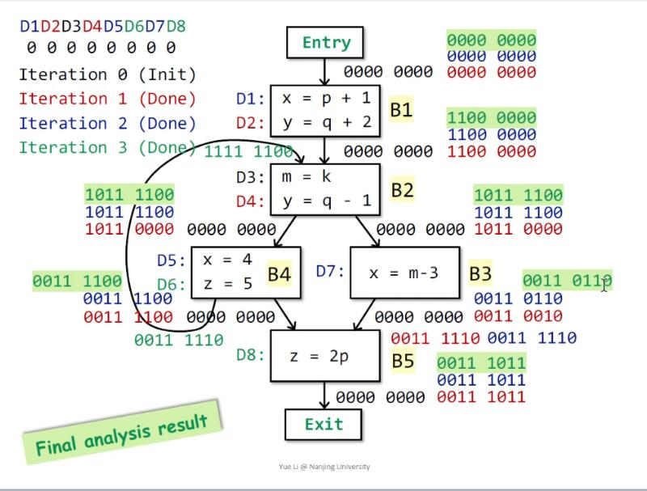

# Software Analysis lecture3 笔记-Data Flow Analysis I

这一节和下一节讲数据流分析的应用部分。静态分析技术里面的应用有很多，但这门课会详细讲到的只有三种，而这些应用采用的分析方法却是通用的，这些应用分别为：

+ Reaching Definitions Analysis
+ Live Variables Analysis
+ Available Expression Analysis

选用这三种的原因是这三种在静态分析技术里面非常有代表性，其中RDA和LVA为may analysis，AEA为must analysis；而RDA和AEA又是forward analysis，而LVA是backward analysis；首先解释下may analysis的意思，may analysis要求对程序进行over-approximate，而must analysis要求对程序进行under-approximate，或者可以这样理解，may analysis输出的报告是一种特称命题（存在分支使得X发生），而must analysis是一种全称命题（对于所有分支，X必然发生）；来看例子

```
x = 1
input = stdin()
if(input < 10) {
    x = 11 
} else {
    x = 29
    y = 100
}
z = 5
w = (z.equals(x) ? 1 : 2) + y
```

有一个典型应用就是对以上代码做未初始化变量检测分析，输出报告为*y可能未初始化*，可见只有一个分支使得y没有初始化，但是仍然需要报告，这就是一种may analysis。

一个must analysis的典型应用，如果整数a，b都在-128~127之间，那么将它们之间的equals等价替换为==；所以对于以上代码，输出报告为*x和z均在-128~127之间总成立*，因为x和z在任何分支上都满足，以此可以指导编译器将equals替换成==，这个就是must analysis。

那么到底什么是数据流分析呢？数据流分析其实就是关注数据是如何在控制流图上沿着边（控制流）到达节点（基本块）而变化，这些数据会反馈出一些信息，例如在某个定义是否能到达某个节点；从上节课知道一个程序可以等价为一个控制流图，而图上关注的数据则会根据要分析的问题而定，例如上节课中分析除0错误时由一系列的+，-，unknown，undefined组成，所以不同的分析会有不同的数据抽象，不同的转换函数，以及不同的approximation策略。

对于三地址码中的每一条语句s，分别有一个输入状态IN[s]和一个输出状态OUT[s]与它前后的两个点分别关联；而对于单一分支上连续的两个节点s1，s2则有OUT[s1] = IN[s2]；对于有分支的情况，例如对于分岔处s1之后有分支s2和s3则有OUT[s1] = IN[s2] = IN[s3]；而对于分支汇聚处例如s1和s3汇聚到s2则有 $$ IN[s2] = OUT[s1] \wedge OUT[s3] $$ ，其中 $$ \wedge $$ 是一个二元操作符，会在不同的分析中被赋予不同的运算（例如 $$ \cap $$ ，$$ \cup $$ ），可以理解成一个函数 $$ f:OUT_1, OUT_2 ... OUT_n \to IN $$ 。


有了以上定义，那么就可以定义语句对应的转换函数了。对于一个语句s，语句前的状态为IN[s]，语句后的状态为OUT[s]，那么定义此语句的转换函数为 $$ f_s $$ ，在前向分析中，$$ OUT[s] = f_s IN[s] $$ ，而在后向分析中，则有 $$ IN[s] = f_s OUT[s] $$；而对于基本块B(s1, s2...sn)，则有IN[B] = IN[s1], OUT[B]=OUT[sn], $$ OUT[B] = f_B IN[B] = f_{sn} \circ ... \circ f_{s2} \circ f_{s1} (s1) $$ ，对于B前面有分支的情况则有 $$ IN[B] = \bigwedge^{i=1}_n OUT[P_i] $$ ( $$ P_i $$ 是B的前驱)。

## Reaching Definition Analysis

reaching definition是用来分析变量从程序中的一点p的定义是否可以到达程序中的另一点q，也就是如果存在一条程序路径从p到q，p处的一个变量v的定义到达q的路上都没被重新定义那么就说v在p处的定义能到达q，注意这里所说的定义是一个赋值语句；RD分析可以用来分析未定义变量，例如对于以下程序，注意这里的代码不是三地址码，对其进行RD分析，首先进行每一条语句的前后（也叫程序点）状态进行抽象

```
                            OUT[entry] = IN[1] ---RD{}             USE(a:0, b:0)
1: int a;                   OUT[1] = IN[2]     ---RD{a:?}          USE(a:0, b:0)
2: double b = 4;            OUT[2] = IN[3]     ---RD{a:?, b:2}     USE(a:0, b:0)
3: println(a + b);          OUT[3]             ---RD{a:?, b:2}     USE(a:1. b:1)
```

其中最左边的为语句编号，RD(x, y)表示在x有定义y可以到达该点（也说此时x的值等于在y处的定义），?表示没有定义或者说空定义，而USE(x:)则表示x是否在该点被使用，为1为使用，_为0为未使用，利用RD分析得到RD输出，然后再得到USE输出，逐语句检测是否存在RD(x:?)和USE(x:1)同时发生的情况，如果有则可能发生了变量未定义，如例子中的第三句，为什么是可能？因为对于存在分支的情况，会使用over-approximate的分析所有说是可能，这是一个may analysis。

继续上面的例子，有了数据的抽象，那么就应该设计转换函数了，在RD的分析中，可以想象，所有语句中只有那些定义语句才会使得RD集合发生改变，而定义语句的作用又分为两种，一种是对一个已经被定义过的变量重新定义，一种是初始化变量；而第一种也可以说是*终结（kill）了变量其他地方的所有定义，生成了变量新定义*，由此容易写出其转换函数的一种形式为

$$! OUT[B] = gen_B \cup (IN[B] - kill_B) $$

补充课上讲的一个例子


有了转换函数，下面继续来讲如何对程序做over-approximate，这个操作是在分支汇聚处做的。例如


的分析结果应该是，P1的输出和P2的输出做集合并操作，所谓over就是不放过任何一个分支，不作运行时假设，得到应该是

$$! IN[B] = \ bigcup^{i=1}_n OUT[P_i] $$

而 $$ P_i $$ 代表B的前驱。

得到每条语句前后点（也可以叫程序点）关联的RD集合的伪代码算法描述如下，其算法输入是一个CFG，又因为静态分析的基本单元一般是一个基本块，所以计算RD也是以基本块为基单元，输出是每一个基本块的输入状态和输出状态。

```
OUT[entry] = {} // 初始化入口的输出状态为空
for (each basick block B\entry) // 除entry外的所有基本块
    OUT[B] = {} // 初始化所有基本块的输出状态为空
    while (changes to any OUT occur) { // 如果有基本快的输出对比前一次状态改变了即继续循环
        for (each basic block B\entry) { // 除entry外的所有基本块
            P = predecessor of B // 得到B的所有前驱
            IN[B] = for (each basic block P) { union OUT[P] } // B所有前驱的OUT做集合并的得到IN[B]
            OUT[B] = gen(B) union (IN[B] - kill(B)) // 基本块生成的定义 并上 B的输入状态减去B终结了的定义 得到OUT[B]
        }
    }
```

算法描述可能会理解起来非常的不直观，首先通过一个小例子来说明一些算法的细节：

```
1: x = 1                
2: y = 2
3: e = 0
4: if e > 10 goto 7
5: e = y + x
6: x = x + 1 goto 4
7: y = x 
```

对于以上代码，先划分基本块，这里为了详细的说明故将一条语句作为一个单元进行分析，划分基本块来分析的方式是一样的，将该程序的CFG画出来，下面给出其第一次迭代时候的结果，算法中先对所有的OUT初始化为{}，执行得到每一条语句对应的gen，IN和kill，其对应的CFG如下图：


entry: OUT[entry] = \{\}

1: $$! gen_1 = \{x:1\}, IN[1] = OUT[entry], kill_1 = {x:6} \to OUT[1] = \{x:1\} \cup (\{\} - \{x:6\}) = \{x:1\} $$

2: $$! gen_2 = \{y:2\}, IN[2] = OUT[1], kill_2 = \{y:7\} \to OUT[2] = \{y:2\} \cup (\{x:1\} - \{y:7\}) = \{x:1, y:2\} $$

3: $$! gen_3 = \{e:3\}, IN[3] = OUT[2], kill_3 = \{e:5\} \to OUT[3] = \{e:3\} \cup (\{x:1, y:2\} - \{e:5\}) = \{x:1, y:2, e:3\} $$

4: 因为是无定义语句，所以 $$ gen_4 = \{\}, kill_4 = \{\}, IN[4] = OUT[4] $$ ; 得 $$ OUT[4] = IN[4] = OUT[3] \cup OUT[6] = \{x:1, y:2, e:3\} \cup \{\} = \{x:1, y:2, e:3\} $$

5: $$! gen_5 = \{e:5\}, IN[5] = OUT[4], kill_5 = \{e:3\} \to OUT[5] = \{e:5\} \cup (\{x:1, y:2, e:3\} - \{e:3\}) = \{x:1, y:2, e:5\} $$

6: $$! gen_6 = \{x:6\}, IN[6] = OUT[5], kill_6 = \{x:1\} \to OUT[5] = \{x:6\} \cup (\{x:1, y:2, e:5\} - \{x:1\}) = \{x:6, y:2, e:5\} $$

7: $$! gen_7 = \{y:7\}, IN[7] = OUT[6] \cup OUT[4], kill_7 = \{y:2\} \to OUT[7] = \{y:7\} \cup (\{x:1, y:2, e:3\} \cup (\{x:6, y:2, e:5\} - \{y:2\})) = \{x:1, x:6, y:7, e:3, e:5\} $$

这里就不继续写第二次迭代的过程了，附课上老师讲过的一个稍微复杂一点的例子，集合用多个0表示，例如第00010表示第1、2、3、5个定义不可以到达该点，第4个可以，全0也表示初始化的{}状态，这个属于编程上的技巧，其对应的结果如图

 

从以上例子中可以得到一些结论：

1. 非定义语句的IN和OUT是不变的
2. 对于任何语句，其gen和kill是不变的，可以认为是一个常量
3. 当次的IN必定大于等于上一次迭代时候同一个语句（基本块的）IN，所以OUT也必定是大于上一次迭代的OUT，也说此算法是单调（monotonic）的
4. 算法一定会停下来（算法达到了不动点（fixed point）），原因是定义数量是有限的且因为3得出的算法是单调的结论，想象一个函数单调并值域有限，随着算法随着自变量增大而到达了最大值
