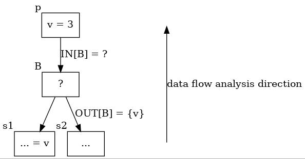
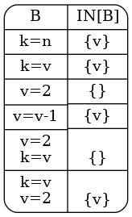
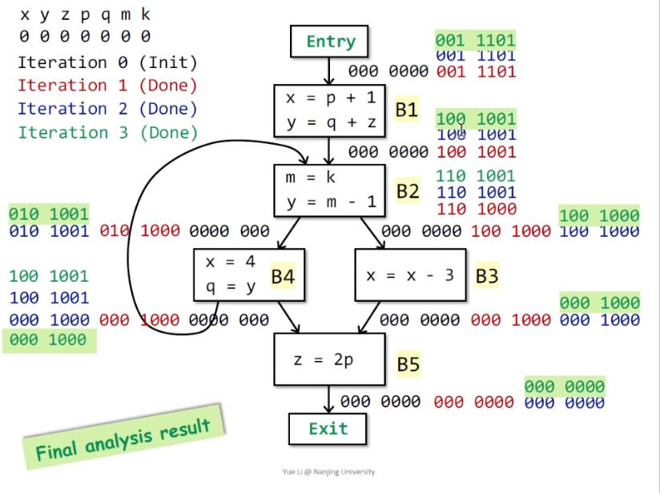
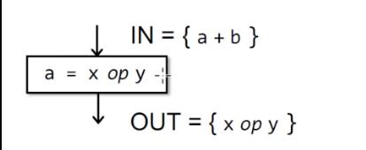
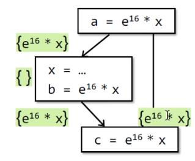
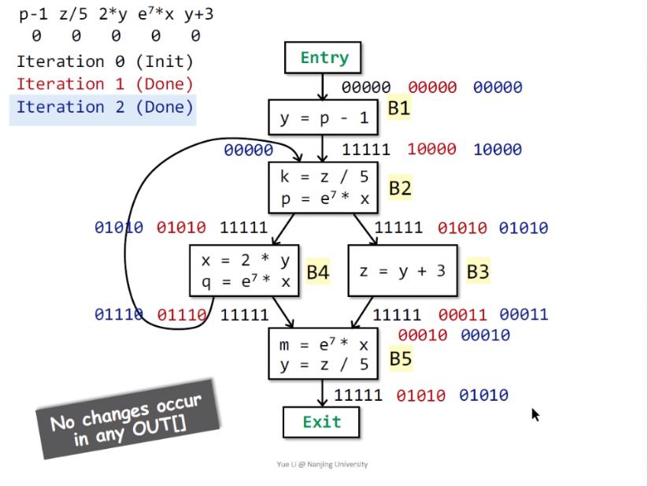
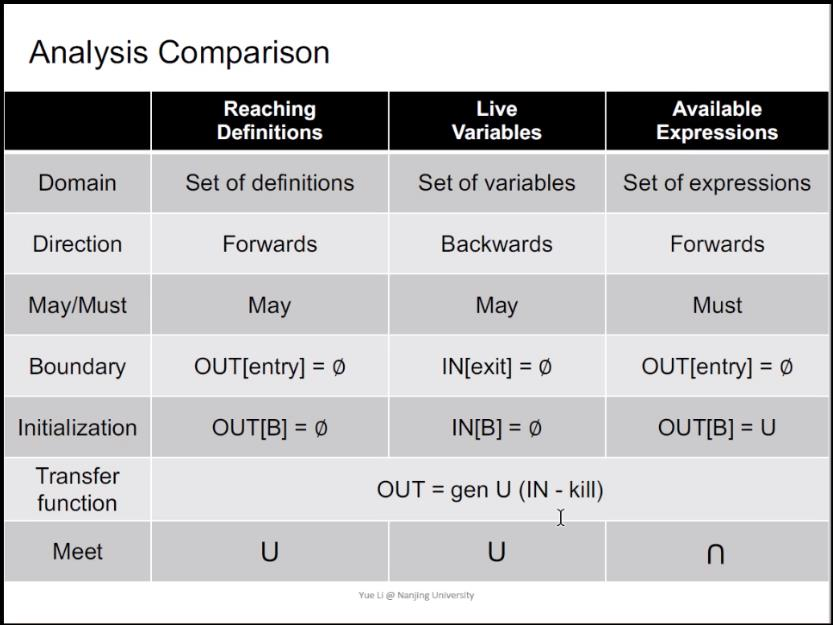

# Software Analysis lecture4 笔记-Data Flow Analysis II

这节课通过讲另外两个典型分析来加深对分析步骤和过程的理解，分别为Live Variables Analysis和Available Expressions Analysis。之前的课程提到过前者是一个backward analysis，后者为一个must analysis；其实关于前者的表述说的不够准确，并没有任何一种分析必须用backward或者forward的方式来做，而只是哪一种放分析方式更方便的区别而已，LVA就是一种用backward方式来做更方便的分析。

### Live Variables Analysis

首先讲一讲这个分析的应用可能会对理解更有帮助，课程上讲LVA用于编译优化的一个例子，当在某个程序点上寄存器不够用的时候，优先移除寄存器上那些以后不会再被使用的值，也就是LVA里面说的dead variable。如果觉得概念太抽象，也可以从具体洞见抽象，把LVA的输出看作是**某个变量在某个点上是不是可以被移出寄存器的意思**。

LVA关注的是在程序中的每一个点，某个变量的值是live或dead。如果在一个程序点p上被赋值的变量v（也可以说是v在p点的值），在p点之后，在被重新赋其他值之前，被使用了，那么就说v在p点上（的值）是live的，否则就是dead的。回看之前那句加粗的话应该比较容易明白。例如：

```
3-address code      program point
s1: a = 3           OUT[s1]
s2: b = 4           OUT[s2]
s3: c = 5           OUT[s3]
s4: a = b + c       OUT[s4]
```

对于这样的一个程序，可以很清楚的看到在s4语句a被重新赋值了，所以a=3这个值占用的寄存器从开始到结束都没有被使用，所以在s1之后就可以直接将a=3这个的值的信息移除，因为a在s1的赋值之后，在被赋其他值（s4）前没有被使用过，所以a=3的值在这段代码中的任意一点都是dead的，看另一个例子：

```
3-address code      program point
s1: a = 3           OUT[s1]
s2: b = 4           OUT[s2]
s3: c = b * a       OUT[s3]
s4: c = c + 5       OUT[s4]
s5: a = b + c       OUT[s5]
```

此时a=3在OUT[s1]，OUT[s2]都是live的，因为s3使用了a=3这个变量的值；而OUT[s3]这一点上a=3这个值就是dead了，这个时候就可以将a=3占用的寄存器释放掉，因为在OUT[s3]到OUT[s4]的时候a=3没有被使用了，紧接着s5就会重新赋值a。

如果还不明白，可以继续看最后的具体的分析例子。

分析的第一步依旧是数据的抽象，只对关注的数据作抽象，这里关注的是变量的赋值，例如程序中的100个变量v1 v2 v3 ... v100，在程序上的每一点这100个变量的状态是live或者dead用1和0来表示，所以每个程序点上的状态可以用100 bits的向量来表示

```
000000000000...00
|____        ___|
     100 bits
```

可以容易观察到，这个分析使用backward分析更方便。（实际上这个原因没那么好表述，暂按下不表）

因为采用了backward分析，所以对于数据流分析的流向是从exit往entry，对于B的所有后继s，做over-approximate的时候有

$$ OUT[B] = \bigcup_{i=1}^n IN[s_i] $$



来看看当B具有不同的语句时，IN[B]的结果：



总结B和IN[B]的关系，可以写出其中的一种转换函数形式为

$$ IN[B] = USE_B \cup (OUT[B] - def_B) $$

顺便提一下，静态分析中的很多转换函数都是generate和kill这种pattern的。

之前课程用到的迭代求解算法是一种比较通用的静态分析算法，这次的分析一样可以用迭代算法来求解，算法如下：

```
IN[exit] = {} // 初始化出口的输入状态为空
for (each basic block B\exit) // 除exit外的所有基本块
    IN[B] = {} // 初始化所有基本块的输入状态为空
while (changes to any IN occur) { // 如果有基本快的输入对比前一次状态改变了即继续循环
    for (each basic block B\exit) { 除exit外的所有基本块
        S = successor of B // 得到B的所有后继
        OUT[B] = for (each basic block S) { union IN[S] } // B所有后继的IN做集合并的得到OUT[B]
        IN[B] = use(B) union (OUT[B] - def(B)) // 基本块中使用的变量 并上 B的输出状态减去B中的重新赋值的变量 得到IN[B]
    }
}
```

may analysis的块初始化一般使用“空”（bottom），而must analysis的初始化一般使用“所有”（top），这个不明白不重要，下一课理论部分会讲到。

咋看似乎和Reaching Definitions Analysis有点像，都和赋值语句相关。其实不然，RDA是从定义到重新定义的那个点之间都是reach的，而Live Variables Analysis是从定义到最后一次使用这个定义中间是live的。而且RDA对于每一个赋值语句都相当于一个新的definition（占用多个bit），而LVA的变量在输出中只可能占用一个bit。

附上课上的一个详细分析例子



### Available Expressions Analysis

一个表达式`x op y`在程序点p是可用的（available），如果满足：

1. 所有从entry到p的路径都必通过`x op y`的求值语句（evaluation）
2. 在最后一次`x op y`求值后，没有重定义x或者y的值 

其中op表示一个运算符，说的透彻一点就是一个表达式在某一程序点是否可以等价的被一个“已经计算好的常量”替换；如果x或者y被重定义了。表示之前“计算好的常量”不能再使用了，这个也是非常自然的想法。

算法的第一步依旧是数据抽象，这里关注的对象是表达式，每个程序点上的状态表示表达式是否可用，1为可用，0为不可用，那么在程序点上用100 bits来表示程序中的100个表达式在该点的可用性。

而这个分析是一个must analysis，所以如果某个表达式在某个点上是可用的，那么需要这个点之前的所有分支都会对这个表达式求值。重新定义表达式中任意变量都会导致一个可用的表达式变成不可用。



上面又用到了之前提到的generate和kill的函数模式。

它的转换函数如下：
$$ OUT{B} = gen_B \cup (IN[B] - kill_B) $$

注意一下下面这个例子，虽然x在左边的分支被重新赋值了，但是实际上算法应该关注的是**表达式**，也就是`e^16 * x`，在运行时过程不同分支中x确实会有不同的值，但分析的结果仅仅说是在分支汇合处“可以用已经算好的`e^16 * x`的值来替代下一个表达式的意思”，而不关注这个表达式最后真正算得的具体值，如果觉得有点绕回去看看定义就明白了。



由此也可知在分支汇聚的地方不再是前面的 $$ \cup $$，而是 $$ \cap $$

$$ IN[B] = \bigcap ^n_{i=1} OUT[p_i] $$

p是B的前驱。

迭代求解算法如下：
```
OUT[entry] = {} // 初始化入口的输出状态为空
for (each basic block B\entry) // 除entry外的所有基本块
    OUT[B] = all // 初始化所有基本块的输出状态为“所有”，all表示所有表达式都为可用
while (changes to any OUT occur) { // 如果有基本快的输出对比前一次状态改变了即继续循环
    for (each basic block B\entry) { 除entry外的所有基本块
        P = predecessor of B // 得到B的所有前驱
        IN[B] = for (each basic block P) { intersect OUT[P] } // B所有前驱的OUT做集合交的得到IN[B]
        OUT[B] = gen(B) union (IN[B] - kill(B)) // 基本块生成的表达式 并上 B的输入状态减去B中的修改了值的变量的表达式 得到OUT[B]
    }
}
```
附上一个课上一步一步分析的例子



最后来一个三种分析的对比大合照



好了，终于终于，下一课就要讲到我很喜欢的理论部分了，下两节课之后就可以理解之前讲的三种分析都可以看作是基于格（lattice）上求不动点（fixed point）的过程，可以以一种更数学的视角去理解这些分析。

references:

[[1] https://www.bilibili.com/video/BV19741197zA](https://www.bilibili.com/video/BV19741197zA)