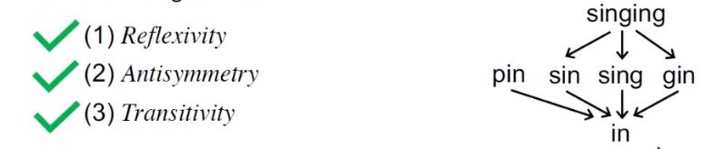
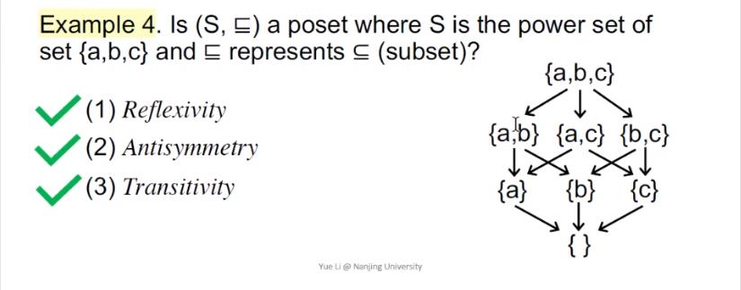
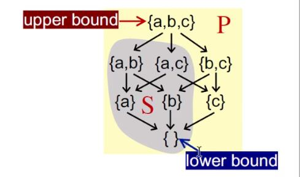
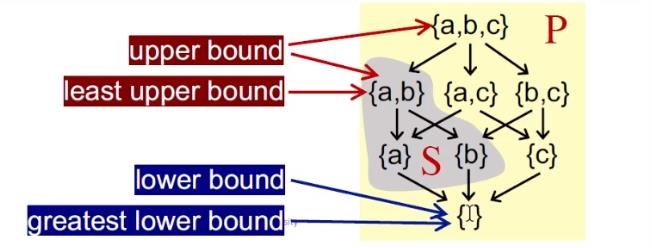
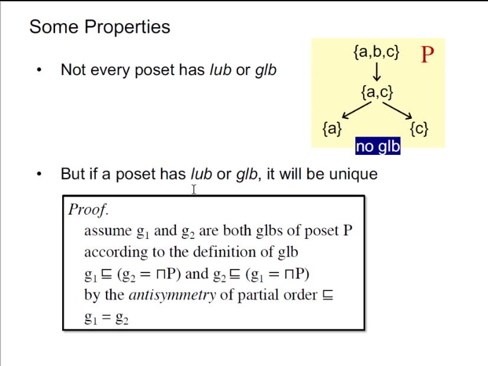

# Software Analysis lecture5 笔记-Data Flow Analysis - Foundations I

这节课和下节课讲数据流分析的理论部分，涉及的内容还是有点多的，但是可以从更抽象更一般化的视角来审视静态分析。

## 不动点（fixed point）：

对一个有k个结点的控制流图（程序），迭代求解算法是在每一次迭代后更新结点n的输出状态OUT[n]，所以每个时刻控制流图的状态 $$ S_cfg $$ 可以用一个k元组来表示，这里的k可以理解成例如RDA里面的定义的数量：

$$! S_cfg = (OUT[n_1], OUT[n_2], OUT[n_3]...OUT[n_k]) $$

设OUT[n]的值域为V，那么有 $$ S_cfg $$ 的值域为 $$ (V_1 \times V_2 \times V_3 \times ... \times V_k)，用 $$ V^k $$ 表示。

由此，可以定义迭代算法的每一次迭代为一个映射 $$! F:V^k \rarr V^k $$

迭代算法写作 $$ y = F(x) $$ ，而当 $$ F(x) = x $$ 时，也就是输出等于输入的时候算法停止，而在数学中，如果发生 $$ x = F(x) $$ 的情况，就说x是函数F的一个不动点，所以此时也可以说函数（迭代算法）到达了不动点x。

有了以上理论的铺垫，要解答以下三个问题，个人也觉得这也是很多数学中的固定发问句式，例如解方程。

问题1：算法会终止吗，或者说算法会到达不动点吗，或者更数学一点，该方程有解吗？

问题2：如果可以到达，那是否仅存在一个不动点，如果不止一个，那么找到的解是最好的一个吗？

问题3：算法何时可以到达不动点，也可以说最坏情况下需要多少步骤能到达？

回答以上问题，需要一些离散数学知识的加持！

## 偏序与上下界（partial order and bounds）：

在集合P上，定义一个二元关系 $$ \le $$，记住 $$ (P, \le) $$，注意这 $$ \le $$ 不是“小于或等于”的意思，而是一种抽象的二元关系，这个二元关系满足以下条件：

1. 自反性（reflexivity）：$$ \forall x \in P, x \le x $$

2. 反对称性（antisymmetry）：$$ \forall x, y \in P, x \le y \wedge y \le x \Rightarrow x = y $$

3. 传递性（transitivity）：$$ \forall x, y, z \in P, x \le y \wedge y \le z \Rightarrow x \le z $$

满足偏序关系集合P为偏序集（poset）。来几个例子强化理解，

如果集合S表示整数集，二元关系为“小于等于”，那么 $$ (S, \le) $$ 是否是一个偏序集？按定义判断：

对于任意整数x，x总是满足 $$ x \le x $$，满足条件1

对于任意整数x，y，如果 $$ x \le y $$ 且 $$ y \le x $$，那么必然x=y，满足条件2

对于任意整数x，y，z，如果 $$ x \le y $$ 且 $$ y \le z $$，那么必然有 $$ x \le z $$，满足条件3

所以 $$ (S, \le) $$ 是一个偏序集。

那么如果集合S表示整数集，二元关系为“小于”，是否是偏序集呢？可以看出该关系并不符合条件1，所以必然不是偏序集。

如果S表示一堆英语单词，二元关系表示“子字符串关系”，$$ sl \le s2 $$ 表示s1是s2的子串，用图表示这个S的子串关系：

所以这个也是偏序关系。

偏序的意思是部分有序，这里的序自然是一种二元关系的意思，偏序不要求集合内任意两个元素满足这个二元关系，也意味着这个集合中允许存在不可比较（incomparable）的两个元素，也可以说是允许存在某些元素之间不满足这个二元关系，例如上图中pin和sin就不满足子串二元关系。

如果S是 $$ \{a, b, c\} $$ 的幂集，二元关系为 $$ \subseteq $$，那么 $$ (S, \subseteq) $$ 是一个偏序集。

对于一个偏序集 $$ (P, \le) $$，它有子集S，定义：

$$ u \in P $$ 是S的上界，如果满足 $$ \forall x \in S, x \le u $$

$$ l \in P $$ 是S的下界，如果满足 $$ \forall x \in S, l \le x $$

注意u和l可以不是S的元素。

定义S的最小上界（least upper bound），也可以叫S的join，记秨 $$ \sqcup S $$，对于S的所有上界u，都有 $$ \sqcup S \le u $$

定义S的最大下界（greatest lower bound），也可以叫S的meet，记秨 $$ \sqcap S $$，对于S的所有下界l，都有$$ l \le \sqcap S $$

特别地，如果S只包含两个元素a，b，那么 $$ \sqcup S $$ 也可以写作 $$ a \sqcup b $$（a join b），$$ \sqcap S $$ 也可以写作 $$ a \sqcap b $$（a meet b）。

一些偏序集的性质补充:

1. 并非所有偏序集都有lub或者glb

2. 如果一个偏序集有lub或者glb，那么必然是唯一的

## 格（lattice）：

给定一个偏序集 $$ (P, \le) $$，如果对于它的任意两个元素a，b组成的子集，$$ a \sqcup b $$ 和 $$ a \sqcap b $$ 存在，那么就说这个偏序集是一个格。

给定一个偏序集 $$ (P, \le) $$，如果对于它的任意两个元素a，b组成的子集，$$ a \sqcup b $$ 存在，则称为join半格，如果 $$ a \sqcap b $$ 存在，则成为meet半格。

给定一个偏序集 $$ (P, \le) $$，如果对于它的所有子集S，$$ \sqcup S $$ 和 $$ \sqcap S $$ 都存在，那么就说这个偏序集是一个全格（complete lattice）。

全格 $$ (P, \le) $$ 有一个最大元素记住 $$ \top = \sqcup P $$

全格 $$ (P, \le) $$ 有一个最小元素记住 $$ \bot = \sqcap P $$

每一个有穷格P都是是一个全格，反过来不一定，全格可能有无穷的，而数据流分析关注的大多是有穷的全格。

## 单调性（monotonicity）：

一个定义在格上的函数 $$ f:L \rightarrow L $$ 如果满足对所有的 $$ x, y \in L $$，$$ x \le y \Rightarrow f(x) \le f(y) $$，则说该函数是单调的。

## 不动点定理（fixed point theorem）：

不动点定理：如果给定一个全格 $$ (L, \le) $$，定义其上的一个函数f，如果满足以下条件

1. $$ f: L \rightarrow L $$ 是单调的
2. L是有穷的

则说函数f必然存在唯一的最大和最小不动点，并可以通过应用 $$ f(\bot), f(f(\bot))...f^k(\bot) $$ 到达函数的最小不动点，通过应用 $$ f(\top), f(f(\top)), f^k(\top) $$ 到达它的最大不动点，

关于前面三个问题需要等到下面的课程会一一解答。

references:

[[1] https://www.bilibili.com/video/BV1A741117it](https://www.bilibili.com/video/BV1A741117it)
