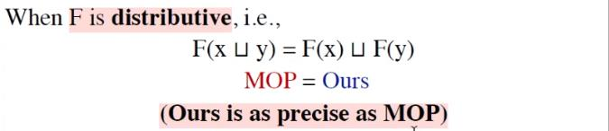
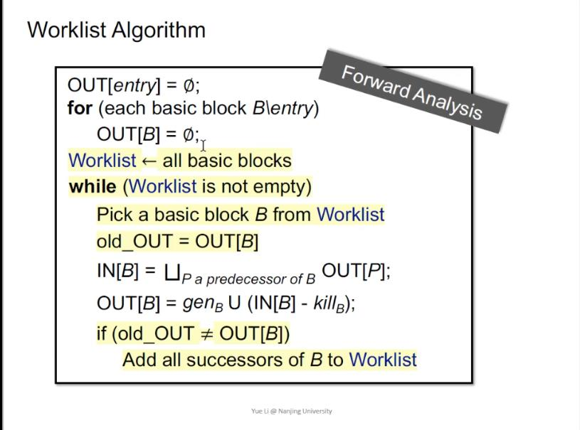

# Software Analysis lecture6 笔记-Data Flow Analysis - Foundations II

这一节是数据流分析的最后一节课，回顾上一节课中提出的三个问题，尽管上节课已经讲到了格理论和不动点定理，但是仍然没有回答问题。原因是不动点定理只适用于格上定义的函数，接下来要做的就是将迭代算法关联到格上定义的函数，证明迭代算法满足格上函数的性质，out[s]的值域关联到格，才可以将不动点定理应用于迭代算法。

给定一个全格L，若满足：

1. $$ F:L \rightarrow L $$ 是单调的
2. L是有穷的

那么就说F的最小不动点能通过一系列的迭代 $$ F(\bot), F(F(\bot))...F^k(\bot) $$ 到达，F的最大不动点能通过一系列的迭代 $$ F(\top), F(F(\top))...F^k(\top) $$ 到达。

**首先证明L是有穷：**

因为控制流中k个结点上的每个结点的输出都可以看作全格L，所以整个控制流的状态可以用一个格的积 $$ L^k $$ 来表示，因为所有L都是全格，所以 $$ L^k $$ 也是全格，且 $$ L^k $$ 是有穷的。

**证明函数F的单调性：**

函数F可以看作由两部分组成，1是每一个结点上的转换函数 $$ f:L \ rightarrow L $$，2是分支汇聚处的join/meet, 分别证明1和2是单调的即可证明F是单调的。

由前面的课程可知，迭代算法中的转换函数都为generate/kill这种形式的函数，而这种函数必定是单调的。证明如下：

因为 $$ OUT[s] = IN[s] + gen_s - kill_s $$，又因为结点的 $$ gen_s $$ 和 $$ kill_s $$ 是不变的，所以可以合并成一个常量c，故有 $$ OUT[s] = IN[s] + c $$，明显OUT[s]会随着IN[s]的增长而增长，可知转换函数是单调的；

证明分支汇聚处的join是单调的，这里仅写出join的证明，meet的证明思路是一样的，证明如下：

$$ \forall x, y, z \in L, x \le y $$，证明 $$ x \sqcup z \le y \sqcup z $$ 即可证明join是单调的

按 $$ \sqcup $$ 定义有， $$ y \le y \sqcup z $$

根据 $$ \le $$ 的传递性有， $$ x \le y \sqcup z $$

因为 $$ y \sqcup z $$ 是x的一个上界，也是z的一个上界

又因为 $$ x \sqcup z $$ 是x和z的最小上界，所以必然有 $$ x \sqcup z \le y \sqcup z $$

QED

因为转换函数是单调的，join/meet操作也是单调的，所以F必然是单调的。

到此，已经可以关联迭代算法到格上了，根据不动点定理，就可以回答之前三个问题的前两问：算法必然可以停止（到达不动点）；到达的不动点一点是最好的不动点（最大不动点或者最小不动点）。还有第三个问题亟待解答。

在回答第三个问题之前，介绍一下一个格的高度，一个格的高度为最低点（bottom）到最高点（top）之间的最长路径。

这个时候再看迭代算法的最坏情况下到底需要运行多少次才能停止。如果每一个循环只让格的k元组$$ (L, L, L, L...) $$ 中的仅一个格爬升了一层，用我们之前的算法来说就是一个循环中只改变了所有结点中一个结点的OUT的一个bit，这个就是最坏情况，这种情况下，算法会运行k\*h步才会停止，这也就回答了第三个问题，迭代算法的最坏时间复杂度为h\*k，其中h为格的高度，k为cfg的结点数。

接下来用格结合之前知识，用图例的方式给出一个综合上的理解：

## MOP

前面讲到了静态分析的各种算法求解，但是还没说过到底这些解有多精确，关于分析这些解的精确度问题，先引入一个概念，MOP（Meet-Over-All-Path Solution），这个一个衡量精确度使用的一个概念，MOP的做法是先各自枚举程序的所有路径，每条路径独立的应用转换函数到达终点才做join/meet，不同于原先的课程中的做法在每一个分支汇聚的结点做join/meet，例如对下图的程序：

原先的做法：$$ F(x \sqcup y) $$

MOP：$$ F(x) \sqcup F(y) $$

但是MOP是一种理想化的做法，因为如果程序包含循坏，那么MOP则无法到达exit，也就无法做join/meet操作，从而导致无法产生结果；另一个原因是容易发生分支指数爆炸。迭代算法的求解结果的精度总是小于或等于MOP精度的，证明：

按照定义由：$$ x \le x \sqcup y, y \le x \sqcup y $$，又因为F是单调的，所以有 $$ F(x) \le F(x \sqcup y), F(y) \le F(x \sqcup y) $$，所以 $$ F(x \sqcup y) $$ 是 $$ F(x), F(y) $$ 的上界，又因为 $$ F(x) \sqcup F(y) $$ 是 $$ F(x), F(y) $$ 的最小上界，所以有 $$ F(x) \sqcup F(y) \le F(x \sqcup y) $$，所以可知迭代算法的结果在may analysis的格上比MOP的结果处于更高处，也就是更不精确，当且仅当 $$ \sqcup $$是一个满足分配律的运算时，迭代算法结果与MOP结果精度相等。前面课程讲到bit vector上的join/meet运算实际上是集合上的并与交，满足分配律。

## 常量传播（Constant Propagation）

下面讲一个求解过程不满足分配律的一个例子——常量传播，给定一个程序点p，变量x在该点是否确定指向一个常量，控制流的在每个结点的输出为二元组的集合 $$ \{(v_1, c_1), (v2, c2), ) ... (v_n, c_n)\} $$，v表示变量，c表示常量，其结点的格和meet运算定义如下：

NDEF表示未定义，NAC表示不是常量（not a constant）

meet运算定义：

!$$ NAC \sqcap c = NAC $$
!$$ UNDEF \sqcap c = c $$
!$$ c \sqcap c = c $$
!$$ c_1 \sqcap c_2 = NAC $$

转换函数:

如果s是x的一个赋值语句，$$ F:OUT[s] = gen \cup (IN[s] - \{(x, _)\}) $$，如果s不是一个赋值语句，F则为一个恒等函数，也就是 $$ OUT[s] = IN[s] $$

该分析算法不满足分配律的解释：

## Worklist Algorithm

该算法是迭代求解算法的一个改进版，回想前面的迭代算法，凡是有一个结点的OUT改变了。那就遍历所有结点，这其中有很多结点大多时候不用重新算，所以也就有了一个很简单粗暴的优化方向，因为只要IN没变，OUT就不会变，所以重新计算的时候只需要将那些IN改变了的结点重新算就行了。以下给出前向分析的代码描述，后向分析同理：

references:

[[1] https://www.bilibili.com/video/BV1964y1M7nL/?spm_id_from=333.788.videocard.0](https://www.bilibili.com/video/BV1964y1M7nL)

[[2] http://www.cse.iitm.ac.in/~rupesh/teaching/pa/jan17/scribes/0-cp.pdf](http://www.cse.iitm.ac.in/~rupesh/teaching/pa/jan17/scribes/0-cp.pdf)

[[3] https://www.cs.tufts.edu/comp/150AVS/06-data-flow.pdf](https://www.cs.tufts.edu/comp/150AVS/06-data-flow.pdf)

