# Software Analysis lecture7 笔记-Interprocedural Analysis

这节课将会讲到过程间分析（interprocedural analysis），前面的课程涉及的分析都尚未对函数调用做出处理，只是做过程内分析（intraprocedural analysis），在过程内分析中遇到函数调用的地方为了达到safe approximation，也就是为了分析的正确，只能做一些非常保守的假设（conservative assumption），但是这些保守的假设会降低分析的精度，例如下面的一个常量传播的例子：

```
void foo() {
    int n = ten();
    addOne(45);
}

int ten() {
    return 10;
}

int addOne(int x) {
    int y = x + 1;
    return y;
}
```
因为对foo做过程内分析的时候，不会在foo和ten，foo和addOne之间关联控制流，所以数据流也无从建立，此时在调用ten和addOne函数的地方只能做保守假设，即是在addOne函数调用后的点上n，x，y都不是常量，那么常量分析在这个例子上也就是彻底失效了。所以需要过程内分析将它们的控制流连接起来，这些关联起各个函数的边也叫过程间控制流边（interprocedural control-flow edge），对于上面的例子，如果进行过程间分析，那么在addOne调用点后即可得到n=10，x=42，y=43的结果。所以为了更高的精度，需要进行过程间分析。

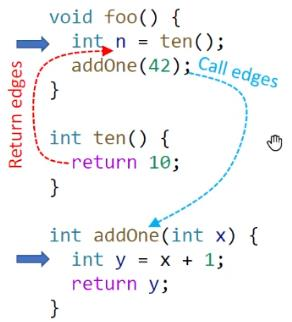

而要做过程间分析，就需要得到函数之间的过程间调用边，为此需要为程序建立调用图（call graph）。

## Call Graph Construction
调用图是一个程序调用关系的一个表现，其中主动发起调用的函数也叫caller，被调用目标函也叫callee，如上面程序的调用图：

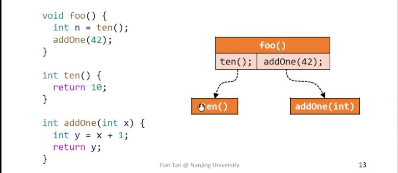

而调用图有着非常广泛的作用，所以很多IDE也集成了这一功能，例如Jetbrains的IDEA，这个在看源码的时候可以帮助缕清函数调用的关系。调用图也作为静态分析领域一个非常重要的议题，而面向对象的语言的调用图构造里面有四种比较有代表性算法，而它们都有速度和精度的差别：

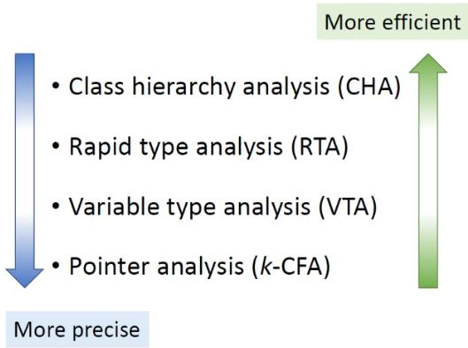

这门课只会讲到其中的两个算法，速度最快的CHA（也是IDEA里面采用的），和精度最高的k-CFA。

因为这门课主要的分析语言是soot上的jimple IR，所以要讲一下jimple里面的几个调用函数相关的指令：

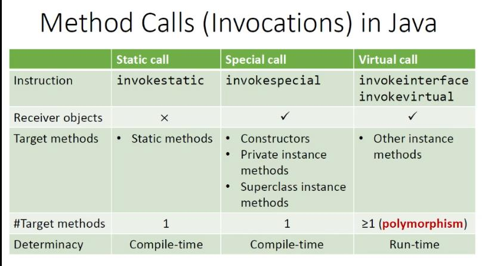

这里不关注invokeDynamic指令，invokeSttatic，invokeSpecial指令的目标函数在编译期间即可决定它的目标方法，且它们的目标方法有且仅有一个，而invokeInterface，invokeVirtual的目标函数需要等到runtime时确定具体的receive object类型才可以确定是哪个函数实现，并因为多态的要求，其对应的目标函数实现也大于等于1，所以构造调用图的关键就是如何处理虚调用（virtual call）。

首先来了解一下运行时的jvm是选择目标函数的方法，对于代码`o.foo(q, p, r)`，方法的选择（分派）由以下因素决定：

1. o所指对象的实际类型
2. 函数签名

记作`<接收对象类型: 函数签名>`的形式，以上面的调用语句为例，假设foo调用的上下文如下：

```
class C {
    T foo(P p, Q q, R r) {
        // funciton body
    }
}
C o = new C()
```
形式为`<C: T foo(P, Q, R)>`
```
    T      C.   foo         (P p, Q q, R r)
    --     |     ---         -    -    -
    |      |     |           |    |    |
返回值类型  |    函数名        — 参数类型 —
—————————  |        |        ———————————
    |      |        |_             |
    ———————|— 描述器 _|（descriptor）——
           |    |___|______
           |              |
函数定义所在的class     函数签名
           |——————————————|    
```
在这门课程中也可以简写成`C.foo(P, Q, R)`。而由此也可以写出一个模拟runtime方法分派过程的函数Dispatch(c, m)，其中c是调用对象（也叫接收对象）的类型，m是函数签名。

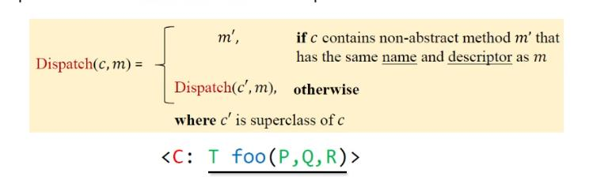

来个例子强化理解:

```
class A {
    void foo() {...}
}
class B extends A {
}
class C extends B {
    void foo() {...}
}
void test() {
    A x = new B();
    x.foo();            // Dispatch(B, A.foo()) = A.foo()
    A y = new C();
    y.foo();            // Dispatch(C, A.foo()) = C.foo()
}
```
终于可以开始讲CHA了，CHA的算法思想就是从调用对象的声明类型（而不是真实的类型）的继承结构里面去构建调用图信息，也就是对于`A z = new ...; z.foo(...);`这样的代码，Dispatch的过程会从z的声明类型A开始，而不是从z真实类型开始选择方法，算法伪代码如下：

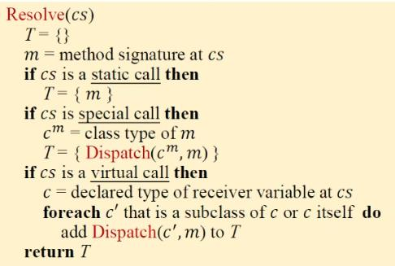

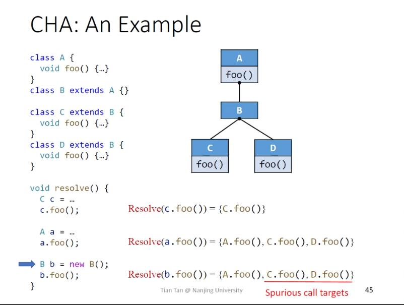

CHA的优势是只需要考虑调用点对象的声明类型的继承信息，不依赖数据流信息，所以速度非常快；缺点是不够精确，产生了大量的虚假调用（spurious target methods）。IDEA里面的callee分析使用的就是CHA。

有了Resolve方法实现对函数调用的分派处理，那么构造整个程序（whole program）的调用图的算法也很容易得到了，算法的伪代码：

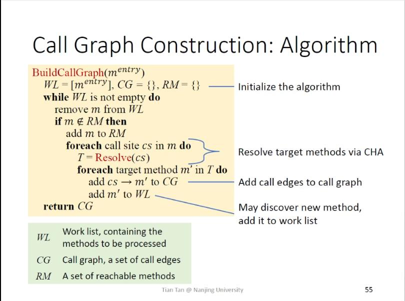

## Interprocedural Control-Flow Graph
CFG代表的是单个方法的控制流，而ICFG则代表整个程序。ICFG的形式是在CFG上加上两类边：
- 调用边（call edge）：从调用点（call site）出发，连接被调用函数（callee）的入口语句
- 返回边（return edge）：从被调用语句出发，连接调用点语句的下一个程序点（返回点）

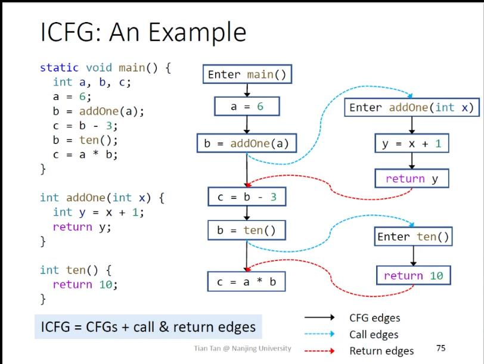

## Interprocedural Data-Flow Analysis
对于过程间的数据流，因为过程间控制流加多了两类边，所以需要考虑调用边和返回边上的转换函数（edge transfer function）。例如对于课程讲到的常量传播的例子，
```
s1
call site
return side
s2
```
IN_\{callSide\} = x \in OUT[s1]|x is past to callee

IN[s2] = OUT[s1] - LHS_\{callSide\} + OUT_\{returnSide\}

常量传播过程间分析的一个例子分析结果：

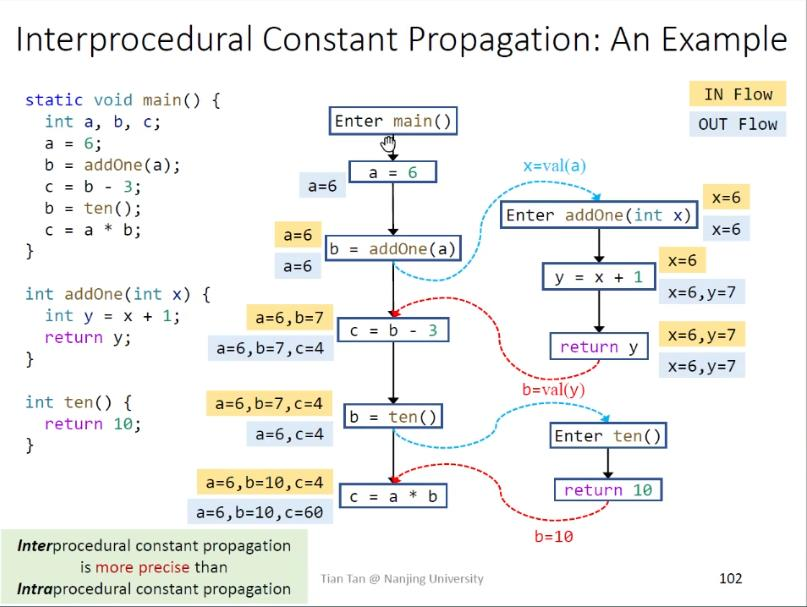

对比过程内分析的常量传播的分析结果：

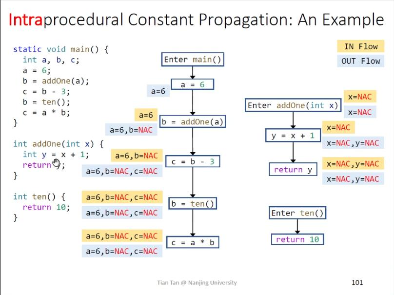

references：

[[1](https://www.bilibili.com/video/BV1GQ4y1T7zm)](https://www.bilibili.com/video/BV1GQ4y1T7zm)
