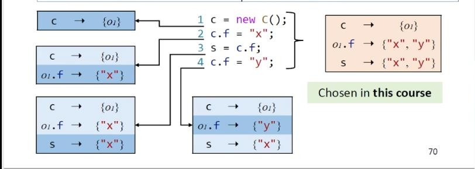

# Software Analysis lecture8 笔记-Pointer Analysis

从上节课可以知道CHA得到的调用图精度不高，所以在这个调用图上进行的分析精度也不高，获取高精度的调用图需要引入静态分析领域一个非常基础而强大的技术——指针分析，接下来四节课将会聚焦于这门有着40年历史，而当今研究依旧活跃的的基础静态分析技术。

对于下面代码进行常量传播：
```
void foo() {
    Number n = new One();
    int x = n,get();
}
interface Number {
    int get();
}
class Zero implements Number {
    public int get() { return 0; }
}
class One implements Number {
    public int get() { return 1; }
}
class Two implements Number {
    public int get() { return 2; }
}
```
因为CHA只考虑变量声明类型的继承关系，在`int x = n.get();`这个调用点后面，会得到3个目标调用，从而导致`x = NAC`的分析结果；而指针分析则是根据指向关系建立调用图，可以得到`n`指向的真实对象为`new One`，所以会精确的得到一个目标调用，对常量传播的分析给出`x = 1`的结果。

指针分析：回答一个指针能指向哪些内存位置。

对应到Java语言里面就是**一个变量或者field能指向哪些对象**，是一种may analysis，因为这个分析中指针的指向是over-approximate，指针分析的作用可以描述为

$$ points-to-relations = pointerAnalysis(program) $$

```
void foo() {
    A a = new A();
    B x = new B();
    a.setB(x);
    B y = a.getB();
}
class A {
    B b;
    void setB(B b) { this.b = b; }
    B getB() { return b; }
}
```
对以上代码进行指针分析的结果如下：
```
Variable/Field      Object
    a               new A
    x               new B
new A.b             new B
    y               new B
```
与别名分析（alias analysis）的区别是别名分析关注的是两个变量是否会指向同一个对象，而指针分析关注的是一个变量可以指向哪些对象。
```
指针分析：variable1可能指向object1，object2，object3
              |---- object1
variable1 --- |---- object2
              |---- object3

别名分析：variable1和variable2具有别名关系
variable1 ---- object1 ---- variable2
```
别名关系可以通过指针分析的结果推导得出。

指针分析的用途：
- 构造调用图，别名信息
- 虚调用内联
- 空指针检测
- 信息流分析
- ...

指针分析的两个关键指标是精度和速度，其中影响其精度速度的四个关键因素为：**堆抽象方式，上下文敏感性，流敏感性，分析域**


这四个方面分别对应关于指针分析四个问题的回答，而在具体的各个因素上，因为不同的课考量，又产生了很多不同的技术。

## 堆抽象（Heap Abstraction）

堆抽象解决的问题是用有限的抽象的对象替代程序中无限的具体的对象，因解决这个问题而被研究出来的技术方向概览


本门课只会涉及到目前为止使用最为广泛一种技术——创建点（Allocation Sites）

### 创建点（Allocation Sites）

用一个抽象的创建点对象来替代所有在该点创建的具体的对象。

例如对于以下代码，第2行的创建点在运行时会创建3个对象，但是利用创建点抽象技术会使用一个抽象的创建点对象o2表示3个具体的对象：


## 上下文敏感性（Context Sensitivity）

对同一个方法的不同上下文处理，是单独的分析，还是将所有上下文join到一起，前者被称为上下文敏感（context-sensitive），后者叫做上下文不敏感（context-insensitive）；上下文敏感技术在一个分析中对同一个方法的调用作多次分析，而上下文不敏感则只会分析一次，也因为上下文不敏感技术将所有上下文join到一起，所以对北上下文敏感技术速度会有所提升，精度会有所下降。也因此上下文敏感技术是用来提升指针分析精度的关键技术，课程后面也会重点讲解。


## 流敏感性（Flow Sensitivity）

分析是否关注控制流（也就是语句顺序），关于这方面的选择决定了是否是控制流敏感的技术，其区别是，流敏感技术为每一个语句（或者基本块）维护一个状态，而流不敏感技术在整个程序中只会维护一个状态，流不敏感技术中的语句没有顺序的区别；而流敏感技术因为维护的状态过多，分析较为复杂，并且在Java这类方法体相对较小的语言上用流不敏感技术来说提升精度有限（但对c语言提升很大），所以本课程也会聚焦于流不敏感技术。



## 分析域（Analysis Scope）

这个方面没有什么技术性的东西讲的，只在于应用上开发者的选择是否使用全部的指针信息，或者全部指针的一个子集。

指针分析只关注那些会导致指针发生变化的语句，在Jimple中有5种语句会导致指针发生变化（pointer-affecting statement），分别为：
```
new语句    x = new T()
肤质语句    x = y
加载语句    z = x.f
存储语句    x.f = z    
调用语句    x.k(a, b, c)  
```
指针有4种：分别为：
```
本地变量    x
静态field  C.x
实例field  c.x
数组元素    array[i]
```
在静态分析阶段无法获取到下标信息，所以使用`array.arr`来替代`array`所有下标的指针，即把所有i指向的对象join到同一个名为`arr`的field；程序中出现的所有x.y.z.w这样的长链field访问在jimple中会被分拆成对多个临时变量的field访问，例如`t1 = x.y; t2 = y.z...`。

对于各种符号以及其定义域，有以下约定：


各语句的传播规则（除调用语句外）：


references：

[[1] https://www.bilibili.com/video/BV1gg4y1z78p/?spm_id_from=333.788.videocard.0](https://www.bilibili.com/video/BV1gg4y1z78p)