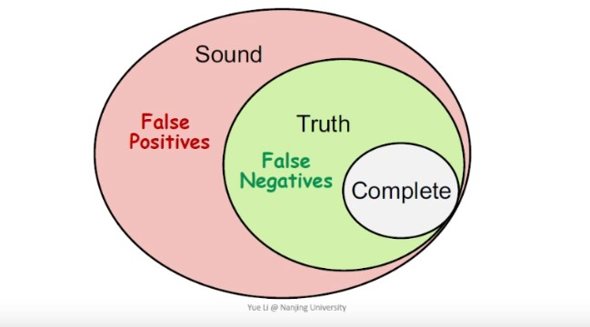

# Static Analysis lecture1 笔记

从这一篇开始我将会整理我的Static Analysis课程笔记放在博客上，这份笔记不会是课程完整内容的记录，而是会融入自己的一些理解和课程内容的补充，有什么理解不到位的或者错误的地方，可以联系我的Email指正，顺便一提，我最近开了这门课的课程群，欢迎对SA有兴趣或者在跟这门课的同学加入我们。

Programming Language这个领域关心的问题大致可以分成三个部分：

1. theory：这个部分关注的问题，例如type system，programming paradigm等。具体的就是诸如generic type/template type的设计，maybe/optional类型改善null，differential programing之类工作属于这一块

2. environment：这个部分关注一些实现上的问题。例如编译器，runtime等，JVM就可以归为这个领域的工作

3. application：这个部分关注在运行前能对程序代码进行的一些工作，例如错误检测，代码优化等等，IDE里面就大量应用了SA的成果，如变量未定义的错误提示，循环中的不变量表达式的移出优化；程序的静态验证（或者叫程序证明），程序合成等等

那么什么样的SA是完美的呢？定义是既overapproximate又underapproximate的SA是完美的。overapproximate也叫sound，underapproximate也叫complete，他们之间的关系可以用一个图很好的表示

complete表示报告包含的错误都是真实的错误，但可能并未包含全部的错误，造成了漏报，
$$! actual reported \subseteq true $$
sound表示报告包含了所有的真实错误，但可能包含了误报的错误，导致误报，
$$! true \subseteq actual reported $$

completeness: true - complete = false negative ->漏报

soundness: sound - true = false positive -> 误报

所以完美的SA等价于false positive =$$ \emptyset $$ 且 false negative = $$ \emptyset $$，既sound又complete

而课上讲过一个大米定理（Rice Theorem），意思是说这个世界上没有完美的SA，这个定理和deep learning领域的universal approximation theorem一般，让人觉得很没意思。

既然完美的SA是不存在的了，那么只能妥协soundness保全completeness。或者妥协completeness来保全soundness，可以根据具体应用去选择妥协哪一个，而实际上绝大多数静态分析应用都是妥协completeness，尽量做到sound，为什么呢？妥协soundness会造成漏报，妥协completeness会造成误报，岂不是静态分析应用大多选择了误报？

static analysis的过程分为两个步骤：

1. abstraction

2. overapproximation

