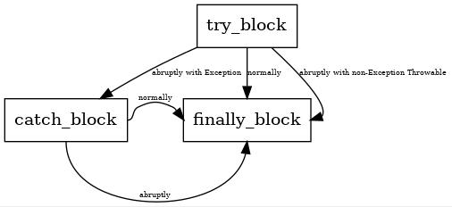

在网上有一段流传甚广的Java代码，用来解释带finally块的异常控制流，甚至很多人不惜拿出字节码来一一解读，仿佛所有的答案都在这紧凑的十六进制指令间，殊不知他们的理解多半是偏离了方向，首先明确某个问题是Java问题还是JVM问题，这个很重要，因为从两个层面去论述某个现象的时候得到的结果往往是大相径庭的。来看看这段代码以及将要思考的几个问题。

```
    public int test() {
        int x;
        try {
            x = 1;
            return x;
        } catch (Exception e) {
            x = 2;
            return x;
        } finally {
            x = 3;
        }
    }
```

这段代码的返回值是什么呢？对于这样的一个问题，首先要思考的是，这段代码对应的控制流图到底是什么样的？细想一下finally的作用，如果你是Java的设计者，这个finally按照设计者想要的样子到底会是怎么样的，其实不难分析，这代码由三个块组成，分别对每个块分析可以很容易得出：

**try块**

try块顺利走完时：try块 -> finally块

try块发生异常时：try块 -> catch块

细想其实上面的分类不够准确，因为Exception并不是java的最顶层的被捕获类，其上还是可能会抛出其他的Throwable子类的，而这种情况下并不会到达catch块，所以需要将上面异常流程补充的更完善一点：

当try块发生Exception或其子类异常时：try块 -> catch块

当try块发生非Exception或其子类异常时：try块 -> finally块

**catch块**

catch块顺利走完时：catch块 -> finally块

catch块发生异常/错误时：catch块 -> finally块

**finally块**

finally块的无论发生异常/错误，或者正常走完，都不会再执行finally块，这个应该比较容易想到。

根据以上，很容易画出上面代码的控制流图：



由此图，可以还原出来Java设计finally的初衷，**“为可能发生异常的地方提供统一的出口”**，这里有点aop代理的内味了，Java语言说明书的描述也仅限于此。

当然这个仍然无法解答最开始那个问题，到底方法的返回值是什么呢？或者说的更专业一点，这个程序的数据流到底是怎么样的呢？其实根据JLS的描述是无法确定这一题的答案的，也就说是这个是典型的未定义行为！尽管如此，如果实现加以限定的话那么这题是可以给出答案的，从该程序的在sun javac上生成的字节码可以画出该程序的数据流图。

字节码

```
  public int test();
    descriptor: ()I
    flags: ACC_PUBLIC
    Code:
      stack=1, locals=5, args_size=1
        
         0: iconst_1 // [0,3] 对应try块的代码
         1: istore_1
         2: iload_1
         3: istore_2

         4: iconst_3 // [4, 7] 对应finally块的代码，try块正常运行时
         5: istore_1
         6: iload_2
         7: ireturn

         8: astore_2 // [8, 12] 对应catch块的代码
         9: iconst_2
        10: istore_1
        11: iload_1
        12: istore_3

        13: iconst_3 // [13, 16] 对应finally块的代码，catch块正常运行时
        14: istore_1
        15: iload_3
        16: ireturn

        17: astore        4
        19: iconst_3 // [19, 20] 对应finally块的代码，其他情况
        20: istore_1
        21: aload         4
        23: athrow
      Exception table:
         from    to  target type
             0     4     8   Class java/lang/Exception
             0     4    17   any
             8    13    17   any
            17    19    17   any
      LineNumberTable:
        line 20: 0
        line 21: 2
        line 26: 4
        line 21: 6
        line 22: 8
        line 23: 9
        line 24: 11
        line 26: 13
        line 24: 15
        line 26: 17
      StackMapTable: number_of_entries = 2
        frame_type = 72 /* same_locals_1_stack_item */
          stack = [ class java/lang/Exception ]
        frame_type = 72 /* same_locals_1_stack_item */
          stack = [ class java/lang/Throwable ]
```

可以看出这份字节码确实实现了Java的语法功能，

而由于整体复制了try块中的变量给finally使用，所以其上的数据流图如下：


到这里已经算得到了这个问题的答案，sun只是恰好选择了使用**复制finally代码到每一个块的出口处，然后使用类似函数传参的方式给finally块传递参数这样的使用方式去实现Java的语法而已**，然而还有几个问题值得思考：

1. try-catch-finally这段Oracle JVM字节码还原回来的Java代码应该是怎么样的呢？

2. Java的finally实现必须这么设计吗？

3. 还有没有什么更好的其他实现方式呢？

4. Java层面的语法能否改的更加直观一些呢？
