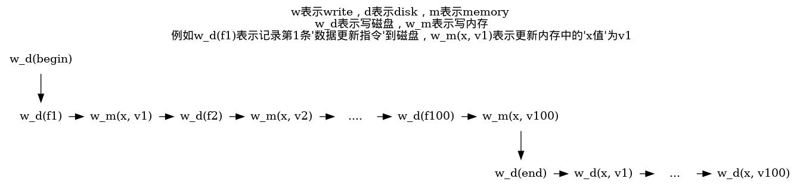
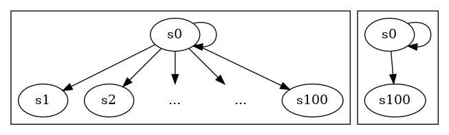
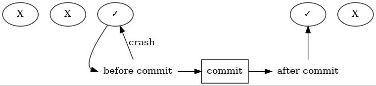

# 数据库，数据库...

最近参加ali的interview暴露了很多问题，虽然大多问题涉及的概念没回答上都是因为遗忘，但个人认为遗忘的速度必然与理解的深度成强负相关。既然这样，干脆趁着这个机会重新梳理一下自己对于一些知识的理解，接下来大概会有一些关于基础概念理解的博文，可能和中文互联网上的一些单纯文字阐述概念的方式不同，我会尽可能用图来表达我的想法，以及会和一些我已经非常熟悉的计算机知识关联起来辅助理解，力求能得到bird's eye view的、能对实际工作有指导意义的结论。毕竟如果不以“具备实际工作的指导意义的结论”为目的出发大概率只会得到例如“所有程序都是二进制”这样正确而无用的结论。

让我们回到数据库发明的初期，刚好已经有一种高级语言提供给我们操作数据库，当然一段两行高级语言操作数据库的代码最后可能会产生一百行对数据的操作的汇编代码，每一句汇编可以看作是一个映射f，fn表示第n句汇编，假设数据库最初的状态是s0, 那么因为更新操作过程中的程序错误，断电等种种原因导致数据库系统崩溃，而使得重启数据库系统后数据库可能会处于一百种状态中的任何一个，f1(s0), f2(f1(s0))...f^100(s0)，作为使用上层语言的程序员必须要为每一个这样的数据库系统，写下一段非常重复的用于状态恢复的代码，以供宕机重启之后检查和修正数据，以达到一个程序员真正想关注的状态，例如一段上层的业务代码

```
account = dbConnect.select(accountId)
account.saving = account.saving - wantToTransfer
if (account.saving < 0) return "cannot transfer, saving isn't enough"
dbConnect.commit(account)
```

其对应的用于宕机重启后检查和修正状态的代码及有可能就是这样

```
account = dbConnect.select(accountId)
if(account.state == s0) {
    do f1...f100
} else if (account.state == s1) {
    do f2...f100
} else if (account.state == s2) {
    do f3...f100
} else if (account.state == s3) {
...
else if(account.state == s99) {
    do f100
}
```

而这些状态实际上程序员一点都不想花心思处理，为什么？因为这些问题反复在每个系统上出现，以至于让程序员不能专心去解决一些高层的业务问题，重复的工作是很消耗人类的耐心的！而计算机一大发展就是让人从底层解脱，可以专心更上层的，更贴姐现实，更具有业务意义的事情上，而这一百个状态中的前九十九个状态实际上是一种底层的，更贴近机器，没有现实业务意义的事情。

并且这看起来似乎是一个普遍的问题，既然是普遍的问题也就是可以设计一个通用的解决方案来解决的，就从上面那段代码开始！如果把上面的代码搬到所有系统上去去用要怎么改呢？每个系统里面从崩溃的一点到最终我们需要的状态之间的指令数和指令都是不确定的，处理逻辑也不确定，怎么做成通用的呢？想象如果是一个线段，是不是只要知道了某一点和终点，就可以求得该点到终点之间的距离（有多少条指令），套到我们的问题就是给某段业务代码加一个end标记用来标记结束，然后在真正执行数据修改前先把所有指令f1，f2，f3...fn顺序地保存在磁盘上，然后记录end标记后才真的去修改磁盘上的数据；但是很快就遇到了一个问题，在记录end标记之前我们可能需要读取一些实时的更新，按照“先存指令，接着记录end标记，再更新磁盘数据”的想法，我们就无法在end之前读取到某个中间状态了。例如上面的例子

```
account = dbConnect.select(accountId)
account.saving = account.saving - wantToTransfer
if (account.saving < 0) return "cannot transfer, saving isn't enough"
dbConnect.commit(account)
end
```

如果要end后才会执行account.saving的修改，那怎么在第三行可以读取到修改呢？这个也有办法，就是在某个点p前复制一份account.saving的副本放在内存中，在保存每个指令进去磁盘前先修改内存里面的值，而用户在p和end中间需要读取中间状态的时候就返回内存里面给他，这样处理似乎不错，那么这个点p是什么呢？到底是从哪个点开始呢？这个不能猜，这个只能让程序员告诉系统了。这个点暂时就叫begin吧，所以现在我们有了一个能凑合着用来做崩溃恢复的程序了。使用了这个方案的一个正常的流程应该是如下面的图所示



在图上我们很容易看出这个流程中所有可能会发生崩溃的点，就是每个结点之间的间隔，看这个图很容易发现我们的做法只能确保在end之后的结点间隔发生崩溃时，系统能按照已经存储的指令去继续更新数据到我们需要的状态s100。但是end之前发生崩溃怎么办？如果发生在end之前，我们甚至无法确保记录在硬盘的指令是完整的，也就是说未来还需要执行什么我们根本无法知晓，这时候其实留给我们选择就两个：1是想方设法确认指令记录到程序中的哪一句了，然后在这个点上继续记录之后的指令，从该点开始继续执行程序；2是删除从begin开始没有记录end标记的日志，因为在end标记记录之前不会对磁盘上的数据做任何修改，所以自然磁盘数据保持了begin前的数据状态。而实际上第一点操作起来非常复杂，所以当然就选第二种啦。这个程序使得使用高级语言的程序员不用再为s0和s100中间的状态处理费神了，可以专心上层的业务问题了，皆大欢喜。用状态机来表示这样一个程序员关注的数据库状态，就是从左图简化成了右图：



而对于本文里面提到的东西，概念发明家们都分别给他们起了名字，**这个崩溃恢复程序（这里面的恢复是说宕机后重新启动数据库的状态恢复为s0或者s100，而不是什么s99，s98...），就叫事务管理程序，而begin和end那个代码执行过程，叫作事务，而那些被记录下磁盘的指令，更普遍的叫法是叫日志，上面提到的“记录指令，更新内存中的数据，写end标记，然后更新磁盘中的数据”这样的做法，就是大名鼎鼎的redo log，而事务管理程序让事务在崩溃后要么到达s0要么达到s100的这个能力就叫保持原子性（atomicity），他们甚至为程序在磁盘上记录end标记后无论数据库崩溃与否必然能到达s100的这个能力起了另一个名字，持久性（ durability），而为了方便表述，人为了从所有状态中区分出s0，s100这一类能作为状态转移目的地的状态出来，就说这些状态是一致性（consistency）状态，当然在实践中就是这些一致性状态必须是满足数据库各种约束的状态，**。

因为redo log使得所有在“往磁盘记录end标记”这个操作之后的间隔发生故障后重启，都会根据日志完整地重做一遍begin到end的操作，所以能保持事务提交成功后的持久性。而在“往磁盘记录end标记”这个操作之前所有间隔发生的故障重启，都会把begin后没有end的日志删掉，内存中修改的值也不会影响到数据库的值，所以保持了事务失败的原子性。


其实ACD三个特性，可以用几句话总结出来，将数据库的状态分成”容易处理的，干净的“状态，和”不容易处理的，繁杂的“状态，前者即为”一致性“的状态，相当于从无数个状态里人为划分出来一些很好的状态来讨论；而原子性呢，则是限定了从一个”干净状态“出发有且只有两个出口——要么是转到自身，要么是下一个“干净状态”；持久性则道明了到底什么情况状态转移会转到自身，什么情况下会转移到下一个”干净状态“。即一致性缩减了数据库状态数量，原子性约束了状态转移路径有且仅有2，持久性规定了状态转移路径在何时选1，何时选2。



另外还有一种用于实现事务管理的做法叫undo log，有别于redo log的时序，但能提供一样的事务实现能力，尽管如此，两者都存在其自身的一些问题，所以工程中的做法很多时候是结合二者实现。

references：

[[1] https://zhuanlan.zhihu.com/p/54981906](https://zhuanlan.zhihu.com/p/54981906) 
