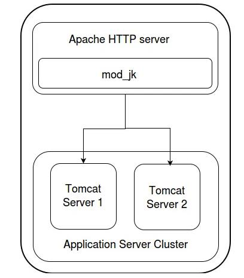

因为目前所在团队效率很低，流程混乱，所以我一直都在思考如何改善实践合作中的很多问题，并对其中的一些思考加以实践验证，大多管理的工作我也无能为力，但是如果是在我权力之内可以控制的东西，我都会尽量去想着改善。

这篇文章的背景是因为我所在的团队在开发期间，需求和bug的改动较多，交付时间也比较赶，导致测试环境频繁的重启，测试的工作也就经常被打断，效率很低。而经常出现的场景是：

1. 测试测A流程出错了
2. 测试提A流程的bug jira
3. 测试继续测B流程
4. 开发修复了A流程bug
5. 开发提A流程bug的pr，合并，并通知测试需要重启
6. 测试中断B流程测试
7. 测试环境重启
8. 测试继续B流程测试
9. 测试继续A流程测试

测试在步骤6，7中被阻塞，无法工作，然而事实上测试可以不用必须承担这段阻塞时间的成本，毕竟大家都不想加班不是？所以有没有那么一种方式可以使得测试环境的重启不需要bother测试人员，使得测试人员可以在6，7也能继续B流程测试，当然办法其实有挺多的，而这篇文章讲的是其中的一种 — 滚动发布。

我的想法是，启动多个实例，实例间共享session，用一个网关把请求切换到最新的实例上，更新的时候就可以把旧的实例关掉，流量切到新的实例上。

想法有了，然后具体操作上，实现方式有很多，喜欢凡工具都自己造的轮子狂人可以用iptables + shell来实现，或者工业派一点的，就喜欢拿靠谱方案直接用的可以用nginx或者apache这样的反向代理软件做网关，我用方案用的是apache + mod_jk + tocmat的方案，然后用docker compose来组织更新逻辑。

关于技术选型的一点思考：使用AJP协议转发而不是HTTP协议转发的原因是因为AJP的数据更紧凑的二进制，而且HTTP会产生大量的握手包，导致性能很差，而AJP建立的是长连接，参考tomcat[官方文档](https://tomcat.apache.org/tomcat-9.0-doc/connectors.html)在AJP connector里面提到的

> If integration with the native webserver is needed for any reason, an AJP connector will provide faster performance than proxied HTTP. AJP clustering is the most efficient from the Tomcat perspective

关于为什么选apache，而不是现在更受互联网公司欢迎的nginx，原因是我们的系统很少静态资源，nginx的epoll调用理论上在静态资源多的时候优势才会比较明显，在动态资源多的时候apache的select调用更好一些，并且select调用是POSIX标准，而且我们团队的部署系统不一定都在docker里面，也有可能会在windows，而windows上nginx也是用select的实现，既然都是用select，为何不用已经玩了很多年select的apache呢？

关于为什么选用mod_jk，而不是mod_proxy，后者的负载均衡功能太局限了，特别是域模型集群，failover之类的都不支持

关于为什么选择用docker compose，而不是docker swarm，或者k8s，因为暂时目前只会再本地环境部署，docker compose已经足够了，不需要swarm的集群部署功能，更不用说k8s

关于session共享，因为我们的框架已经基于JGroups实现了基于multicast技术共享session，lock这类公共信息的功能，所以我这里并不需要使用到redis这类工具存放session


```
# 建立三个目录
mkdir app-test-env
mkdir -p tomcat1/conf
mkdir -p tomcat2/conf
cd app-test-env
touch lb.dockerfile
touch app.dockerfile
touch app2.dockerfile
```
自定义负载均衡的workers.properties
### workers.properties
```
workers.tomcat_home=
workers.java_home=
ps=/

# 声明四个worker，tomcat1合同tomcat2部署的是我们开发的应用，loadbalancer是网关，jkstatus是一个监控loadbalancer的程序，并提供页面对loadbalancer进行运行时修改配置
worker.list=tomcat1,tomcat2,loadbalancer,jkstatus

# tomcat1的AJP端口，tomcat自从爆gostcat漏洞后就默认关闭ajp，稍后需要手动修改tocmat的server.xml
worker.tomcat1.port=8009
# tomcat1的ip地址或者主机名
worker.tomcat1.host=app
worker.tomcat1.type=ajp13
worker.tomcat1.connection_pool_timeout=600
worker.tomcat1.lbfactor=1

# tomcat2的AJP端口
worker.tomcat2.port=8009
# tomcat2的ip地址或者主机名
worker.tomcat2.host=app2
worker.tomcat2.type=ajp13
worker.tomcat2.connection_pool_timeout=600
worker.tomcat2.lbfactor=1

worker.loadbalancer.type=lb
worker.loadbalancer.balance_workers=tomcat1,tomcat2

worker.jkstatus.type=status
```
自定义虚拟主机配置000-default.conf，配置转发规则
### 000-default.conf
```
<VirtualHost *:80>

        ServerAdmin webmaster@localhost
        DocumentRoot /var/www/html

        ErrorLog /var/log/apache2/error.log
        CustomLog /var/log/apache2/access.log combined

    ## cusomize config 配置转发
    <Location /jkmanager>
        JkMount jkstatus
        Order deny,allow
        Allow from all
    </Location>

    JkMount /jkmanager/* jkstatus
    JkMount /app loadbalancer
    JkMount /app/* loadbalancer
    ## end cusomize config
</VirtualHost>
```
编写一个网关的docker file
### lb.dockerfile
```
FROM httpd:2.4

MAINTAINER drshiki unknown@dam.moe

# 将debian官方源换成中科大源
# 安装mod_jk模块
# 修改httpd.conf配置包含mod_jk相关的配置
RUN sed -i 's/deb.debian.org/mirrors.ustc.edu.cn/g' /etc/apt/sources.list && \
    sed -i 's/security.debian.org/mirrors.ustc.edu.cn/g' /etc/apt/sources.list && \
    apt-get update && \ 
    apt-get install apache2 libapache2-mod-jk -y && \
    echo 'Include /etc/apache2/mods-available/jk.load' >> /usr/local/apache2/conf/httpd.conf && \
    echo 'Include /etc/apache2/mods-available/httpd-jk.conf' >> /usr/local/apache2/conf/httpd.conf && \
    echo 'Include /etc/apache2/sites-available/000-default.conf' >> /usr/local/apache2/conf/httpd.conf
 
 # 自定义mod_jk负载均衡的worker配置 
 COPY ./workers.properties /etc/libapache2-mod-jk/workers.properties
 # 自定义apache的虚拟主机的URL转发规则
 copy ./000-default.conf  /etc/apache2/sites-available/000-default.conf

CMD apachectl -D FOREGROUND
```
build docker镜像，并配置构建过程的网络使用代理
```
 docker build 
    --build-arg https_proxy=$HTTP_PROXY \
    --build-arg http_proxy=$HTTP_PROXY  \
    --build-arg HTTP_PROXY=$HTTP_PROXY  \
    --build-arg HTTPS_PROXY=$HTTP_PROXY \
    --build-arg NO_PROXY=$NO_PROXY \ 
    --build-arg no_proxy=$NO_PROXY \
    -t mylb .
```
而因为需要修改server.xml的配置，应用的容器需要编写定制化的docker file:
### app.dockerfile
```
FROM tomcat:9.0.36-jdk8-openjdk

MAINTAINER drshiki unknown@dam.moe

RUN sed -i 's/deb.debian.org/mirrors.ustc.edu.cn/g' /etc/apt/sources.list && \
    sed -i 's/security.debian.org/mirrors.ustc.edu.cn/g' /etc/apt/sources.list && \
    apt-get update && \ 
    apt-get install netcat -y

COPY ./app-server.xml /usr/local/tomcat/conf/server.xml

COPY ./entrypoint.sh /usr/local/tomcat/bin/entrypoint.sh
```

### app2.dockerfile
```
FROM tomcat:9.0.36-jdk8-openjdk

MAINTAINER drshiki unknown@dam.moe

RUN sed -i 's/deb.debian.org/mirrors.ustc.edu.cn/g' /etc/apt/sources.list && \
    sed -i 's/security.debian.org/mirrors.ustc.edu.cn/g' /etc/apt/sources.list && \
    apt-get update && \ 
    apt-get install netcat -y

COPY ./app2-server.xml /usr/local/tomcat/conf/server.xml

COPY ./entrypoint.sh /usr/local/tomcat/bin/entrypoint.sh
```
其他一些较长的配置文件就不放到博客上了，这个计划并最终编写了一份docker compose yml，在[这里](https://github.com/drshiki/app-test-env)，有需要的可以参考一下。

尚待改善的点：

1. 暂时测试出这个框架的session共享机制还有问题，所以使用sticky session，导致一个instance下线了时候该instance上所有用户要重新登陆

2. docker compose太适合服务器环境，准备使用docker swarm

3. 现在上线下线需要手工在jkManager界面完成，编写脚本自动化

4. 前后端分开部署，集成zookeeper动态上下线
